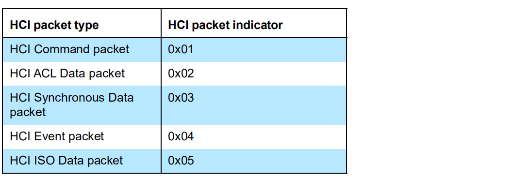

# HCI Transport

HCI Transport 是 Bluetooth 为了适配不同的硬件传输接口而定义的，例如 UART，SDIO 和 USB 。

## H4

H4 是在 UART 上定义的协议，较为简单，仅仅在 HCI 封包前添加一个字节代表该封包的类型。

传输数据格式如下：

| 1 byte  | N byte HCI raw data |
| :-----: | :-----------------: |
| H4 type |    HCI raw data     |

其中封包类型的值为：

H4 对于 UART 的配置有一定的要求：

注意此处使用了硬件流控 RTS/CTS：

- RTS（Ready to Send）：发送请求，为**输出**信号，用于**指示本设备准备好可接收数据**，低电平有效。
- CTS（Clear to Send）：发送运行，为**输入**信号，用于**判断是否可以向对端发送数据**，低电平有效。

H4 接口的接线参考下图：

| Host | Controller |
| :--: | :--------: |
| CTS  |    RTS     |
| RTS  |    CTS     |
|  RX  |     TX     |
|  TX  |     RX     |

因此当 Controller 准备好接收数据时，其 RTS 输出低电平，这样 Host 端的 CTS 就也为低电平，即 Host 可以向 Controller 发送数据。

当 Controller 和 Host 的通信发送错误时，只能通过 HCI Reset 命令来重启。

## H5

bit errors, overrun errors, burst errors.

基于连接的

在每个 HCI 包之前加一个头部，然后再将整个数据组合成 SLIP 协议的数据帧

**SLIP 将一个不可靠的数据流转换成不可靠的数据报流**，

头部字段用于标识数据报，并允许重传。

SLIP 将 0xC0 放置在数据报的起始处和末尾处，并将数据报内部的 0xC0 转义成 0xDB 0xDC，将数据报内部的 0xDB 转义成 0xDB 0xDD 。

